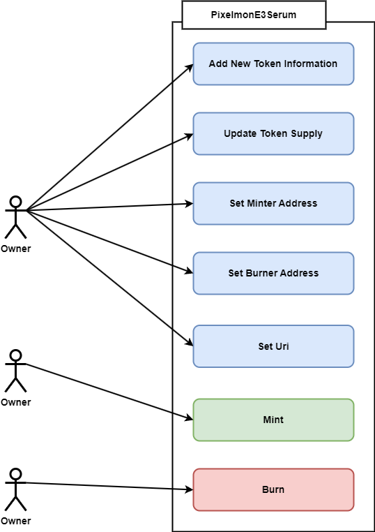

# Pixelmon Evolution Smart Contract

## Authors: Atiq

## Reviewers: Nobel, Shajahan, Shafiul, Excel

## Created on: 16 May, 2023

## Last updated on: 16 May, 2023
## Last updated by: Atiq

# Overview
Pixelmon Evolution 3 Serum will be a new ERC1155 token collection. This token will be given as reward for the users who will be soft staking thier Pixelmon E1, E2 and Trainer token for party squad. This E3 serum will be used for evolving Pixelmon E3 tokens.

For this ERC1155 collection there will be a single token with tokenId 1. The maximum supply for this token will be 1000. 

For this token we will be implementing the [Opensea On chain Royalty Enforcement Tool](https://github.com/ProjectOpenSea/operator-filter-registry). This will ensure that user will not be able to by pass the royalty fee. 

## Product document
* [Pixelmon Party Squad (Soft Staking)](https://liquidxstudio.atlassian.net/wiki/spaces/PP/pages/76972033/Pixelmon+Party+Squad+Soft+Staking)

# Proposed solution
Pixelmon Evolution 3 Serum smart contract is a [ERC1155](https://ethereum.org/en/developers/docs/standards/tokens/erc-1155/) Token. It has the basic functionality of ERC1155. We also implemented the the [Opensea On chain Royalty Enforcement Tool](https://github.com/ProjectOpenSea/operator-filter-registry). Here is a example [code](https://github.com/ProjectOpenSea/operator-filter-registry/blob/main/src/example/ExampleERC1155.sol). For this ERC1155 collection there are a single token with tokenId 1. The maximum supply for this token will be 1000. But both the token supply and suppoerted token Id will be updatable the the contract owner.  

**The Functionality of Pixelmon Evolution 3 Serum Smart Contract**
1. `addTokenInfo` This is a onlyOwner method. By default the contract will have a single serum type with token Id 1. But if the contract owner wants he can add more serums with incremental tokenId.
2. `updateTokenSupply` This is also a onlyOwner method. Using this method the smart contract owner will be able to update the token supply for a particular token.
3. `setMinterAddress` using this method the contract owner will be able to add minter wallet address or remove minter wallet address. Only minter will have the permission to mint token.
4. `setBurnerAddress` using this method the contract owner will be able to add or remove burner wallet address. Only burner wallet will have the permission to burn tokens for users.
5. `setUri` this is also a onlyOwner method. Using this method the owner will be able to set metadata URL.
6. `mint` this is the token minting function. Only the minter will be able to mint token.
7. `burn` this is the token burning function. Only the burner will be able to burn token.


### Usecase Diagram



# Test plan
## Test Cases
```
Deployment test
    ✔ Contract should be successfully deployed 
    ✔ Contract should should not deploy without metadata url as parameter
    ✔ Contract should should not deploy with invalid parameter
    ✔ Deployer should be the initial contract owner

  Base URI functionality
    ✔ Base URI should be set initially
    ✔ Only Owner will be able to set base URI 

  Token Info functionality
    ✔ There should be 1 total token initially
    ✔ Initial token supply should be 1000
    ✔ getTokenInfo should provide error for invalid tokenId

  Add Token Info functionality
    ✔ Only Owner will be able to addTokenInfo 

  Set Minter Address functionality
    ✔ Only Owner will be able to setMinterAddress 
    ✔ Owner will be able to setMinterAddress to both true and false status 
    ✔ Owner will not be able to set zero address as minter address

  Set Burner Address functionality
    ✔ Only Owner will be able to setBurnerAddress 
    ✔ Owner will be able to setBurnerAddress to both true and false status 
    ✔ Owner will be able to set zero address as minter address

  Mint functionality
    ✔ Only Minter will be able to mint token 
    ✔ Minter will be able to mint token for valid address 
    ✔ Minter will be able to mint token valid token ID 
    ✔ Minter will be able to mint token valid amount 

  updateTokenSupply functionality
    ✔ Only Owner will be able to updateTokenSupply 
    ✔ Only Owner will be able to updateTokenSupply for valid tokenId 
    ✔ Only Owner will not be able to updateTokenSupply if already that amount minted 
    ✔ Minter will be able to mint token valid amount 

  Burn functionality
    ✔ Only Burner will be able to burn token 
    ✔ Zero amount can not be burn
    ✔ Invalid tokenId can not be burn
    ✔ More than balance can not be burnt 

  Contract Owner Functionality
    ✔ Deployer should be initial contract owner
    ✔ transferOwnership call from anonymous wallet should through error
    ✔ Only the contract owner can call the transferOwnership method
    ✔ After successfully calling transferOwnership method new wallet will be contract owner
    ✔ After changing contract owner previous owner will get error while calling transferOwnership method 

  Override functionality
    ✔ Support interface method test for coverage
    ✔ Set approval for all test coverage 

  safeTransferFrom functionality
    ✔ Only token holder wallet will be able to transfer token 
    ✔ Only token holder wallet will be able to transfer token in batch 

  uri function test
    ✔ Should consistently return the same token metadata URI
    ✔ Should return empty string if no baseURI available

```
## Unit test
File                    |  % Stmts | % Branch |  % Funcs |  % Lines |Uncovered Lines |
------------------------|----------|----------|----------|----------|----------------|
 Evolution3Serum/             |      100 |    100 |      100 |      100 |                |
  Evolution3Serum.sol         |      100 |      100 |      100 |      100 |                |
All files               |      100 |    100 |      100 |      100 |                |

# Deployment Steps
The purpose of this section is to explain the steps for deploying the Pixelmon Evolution 3 Serum smart contract and configuring it for using in the application.

## Software Requirements
To deploy this smart contract in the Mainnet or in the Goerli test net the following tools need to be installed in the computer.

1. [Node js](https://nodejs.org/en/download/) >= v16.10.0. (16.10.0 Recommended)
2. [Git](https://git-scm.com/downloads) >= v2.37.3

## Cost Supply Requirements
1. The private key of a wallet address that has enough ethers for deploying claim gift smart contracts.
2. Estimated cost: [Estimated Cost for Smart Contract](https://docs.google.com/spreadsheets/d/1YkUcfVHPe8nCuYFyqUJJtdOilcwPghjuLXji4vxWRLs/edit?usp=sharing)

## Smart Contract Deployment Steps
1. Download the smart contract from [git repository](https://github.com/Pixelation-Labs/pixelmon-contracts).  
2. Go to the repository with the command
``` 
cd Pixelmon-evolution-smart-contract
```

3. Copy the example.env file and create the .env file with the following information
```
PRIVATE_KEY=<Deployer wallet private key>
NETWORK=<goerli/mainnet>
METADATA_BASE_URI=<Production metadata base URL>
```

4. Install required packages 
```
yarn install 
```

5. Compile code 
```
yarn compile
```

6. To test the smart contract use this command
```
yarn deploy:pixelmon:evolution:contract:mainnet
```
7. Deploy smart contract For goerli it will be 
```
yarn deploy:e3serum:goerli
```
8. Deploy smart contract For goerli it will be 
```
yarn deploy:e3serum:mainnet
```

9. Publish Smart contract
```
yarn publish:contract:mainnet <NEW_CONTRACT_ADDRESS> <METADATA_BASE_URI> 
```
For goerli it will be 
```
yarn publish:contract:goerli <NEW_CONTRACT_ADDRESS> <METADATA_BASE_URI>
```

10. Set Minter Address

11.  Mint some token

12.  SetUp opensea page

## Smart Contract set up steps
1. Set Minter Address
2. Mint token
3. Check Minted token in opensea
4. Setup opensea page
